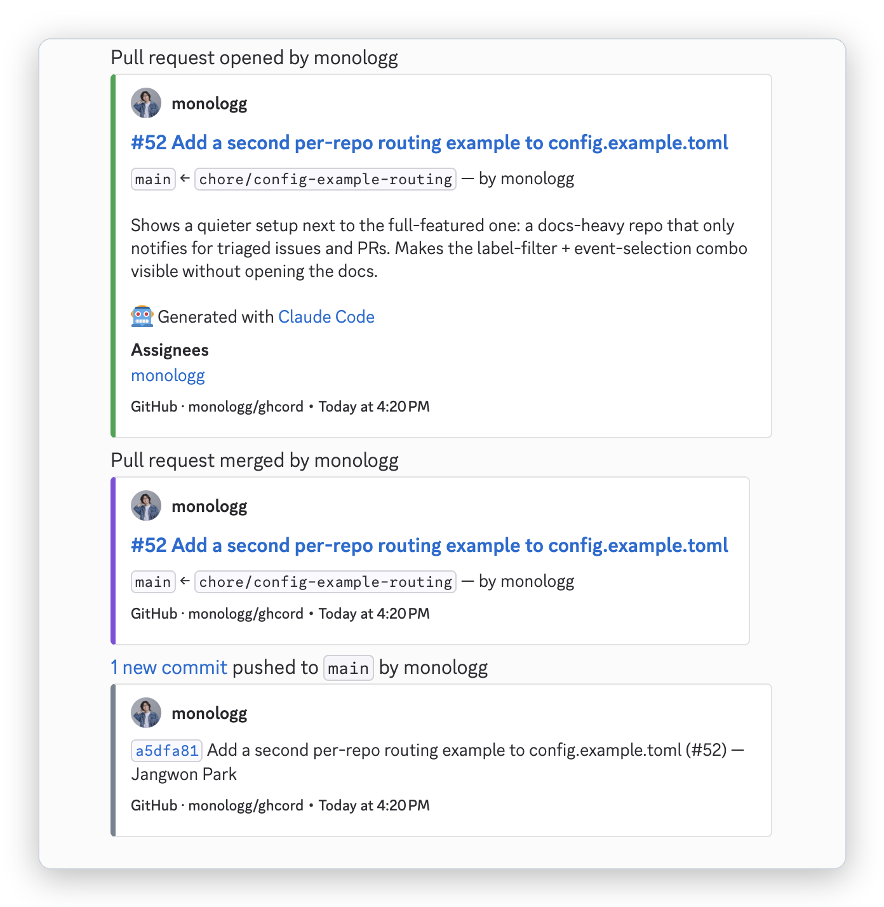
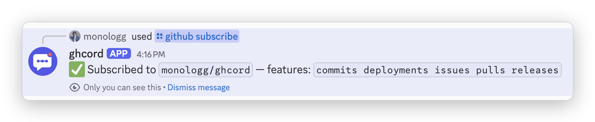
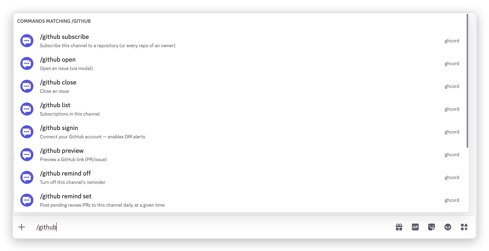

<!-- source: README.md -->

<p align="center">
  <picture>
    <source media="(prefers-color-scheme: dark)" srcset="assets/logo-dark.svg">
    
  </picture>
</p>

<h3 align="center">The missing "GitHub for Discord"</h3>

<p align="center">
  GitHub App 기반의 셀프 호스팅 GitHub ↔ Discord 연동 서버
</p>

<p align="center">
  <a href="docs/ko/README.md"><b>설치 가이드</b></a>
  &nbsp;·&nbsp;
  <a href="#커맨드">커맨드</a>
  &nbsp;·&nbsp;
  <a href="#비교">비교</a>
</p>

<p align="center">
  <a href="LICENSE"></a>
  <a href="https://github.com/monologg/ghcord/actions/workflows/test.yml"></a>
  <a href="https://codecov.io/gh/monologg/ghcord"></a>
</p>

<p align="center">
  <a href="README.md">English</a> | 한국어
</p>

<p align="center">
  
</p>

## 왜 ghcord인가

GitHub은 Slack용으로는 완성도 높은 공식 앱을 제공합니다. 하지만 Discord용으로는 단방향에, 필터도 없고, 레포마다 따로 설정해야 하는 내장 웹훅이 전부입니다. ghcord는 직접 호스팅하는 작은 서버로 그 공백을 채웁니다.

- **한 번의 설치로 모든 레포 커버** — GitHub App을 한 번만 설치하면 앞으로 만들 레포까지 포함해 계정의 모든 레포가 연결됩니다. 레포별 웹훅 설정은 필요 없고, 나머지는 슬래시 커맨드로 관리합니다.
- **자격 증명은 온전히 내 것** — GitHub App, 프라이빗 키, 봇 토큰을 모두 직접 발급합니다. 그 무엇도 타인의 서버를 거치지 않으며, 모든 인바운드 요청은 fail-closed로 검증됩니다.
- **메시지를 읽을 수 없는 구조** — ghcord는 Discord와 순수 HTTP 인터랙션으로만 통신합니다. 게이트웨이 연결도, 메시지 내용 접근 권한도 원천적으로 존재하지 않습니다.

## 주요 기능

- **Slack 호환 구독 문법** — `/github subscribe owner/repo reviews comments`, 증분 추가/제거, 소유자 단위 구독
- **필터** — 브랜치 glob, 라벨 필터, 채널별 이벤트 선택
- **12가지 이벤트 타입의 상세한 임베드** — 이슈, PR, 리뷰, 코멘트, 푸시, 릴리스 등
- **개인 DM 알림** — 리뷰 요청, 리뷰 결과, @멘션
- **채팅에서 바로 이슈 조작 & 링크 미리보기** — `/github open · close · reopen · preview`
- **데일리 리뷰 리마인더** — 대기 중인 리뷰 큐를 정해진 시간에 전송

<p align="center">
  
</p>

## 비교

| | Discord 내장 웹훅 | GitHub for Slack | ghcord |
|---|:---:|:---:|:---:|
| 이벤트 알림 | ✅ 고정 포맷 | ✅ | ✅ 상세한 임베드 |
| 채널별 이벤트 선택 | 제한적 | ✅ | ✅ |
| 브랜치 / 라벨 필터 | ❌ | ✅ | ✅ |
| 계정 단위 구독 (신규 레포 포함) | ❌ 레포별 설정 | ✅ | ✅ |
| 슬래시 커맨드로 구독 관리 | ❌ | ✅ | ✅ |
| 개인 DM 알림 (리뷰, 멘션) | ❌ | ✅ | ✅ |
| 채팅에서 이슈 열기 / 닫기 | ❌ | ✅ | ✅ |
| 정기 리뷰 리마인더 | ❌ | ✅ | ✅ |
| 링크 자동 미리보기 | ❌ | ✅ | ➖ 요청 시 `/github preview` |
| 이슈/PR별 스레드 묶기 | ❌ | ✅ | ❌ 의도적으로 제외 |
| 호스팅 | 없음 | GitHub이 호스팅 | 셀프 호스팅 |

❌/➖로 표시된 두 줄은 의도된 설계입니다. 둘 다 상시 게이트웨이 연결이나 메시지 내용 접근 권한이 필요한데, ghcord는 설계상 이를 허용하지 않습니다 — 게이트웨이 연결에 의존했던 기존 봇들은 하나같이 유지보수 부담을 이기지 못하고 사라졌습니다.

## 커맨드

```
/github subscribe   repo:<owner/repo | owner> [features] [label]
/github unsubscribe repo:<owner/repo | owner> [features]
/github list
/github preview     url:<GitHub URL>
/github open        repo:<owner/repo>
/github close       url:<issue URL> [reason]
/github reopen      url:<issue URL>
/github signin · signout
/github remind      set time:<HH:MM> user:<login> · off · status
```

구독할 이벤트를 지정하는 `features` 값은 GitHub for Slack 앱과 동일합니다:

- **기본값**: `issues`, `pulls`, `commits`, `releases`, `deployments`
- **옵트인**: `reviews`, `comments`, `branches`, `commits:<branch-glob>`

<p align="center">
  
</p>

## 시작하기

ghcord는 직접 호스팅합니다 — 초대할 수 있는 호스팅 인스턴스는 따로 없습니다. 처음 설정에는 대략 **30분**이 걸립니다. 필요한 것:

- Docker를 실행할 수 있는 호스트 (작은 서버면 충분합니다 — ghcord는 256 MB RAM 이하에서 여유롭게 동작합니다)
- 공개 HTTPS 엔드포인트 (리버스 프록시 뒤의 도메인, 또는 Cloudflare Tunnel / Tailscale Funnel 같은 터널)
- 계정 또는 조직에 GitHub App을 만들 수 있는 권한
- Discord 서버의 **서버 관리(Manage Server)** 권한

서버 쪽은 명령어 세 줄이면 됩니다:

```bash
git clone https://github.com/monologg/ghcord.git && cd ghcord
cp .env.example .env && cp config.example.toml config.toml   # 진행하면서 채워 넣기
docker compose up -d --build
```

이제 남은 것은 GitHub App, Discord 앱, HTTPS 엔드포인트 준비입니다 — [설치 가이드](docs/ko/README.md)가 여섯 단계로 안내합니다:

1. [GitHub App 등록](docs/ko/01-github-app.md) — 권한 & 이벤트 체크리스트, 웹훅 시크릿
2. [Discord 애플리케이션 생성](docs/ko/02-discord-app.md) — 봇 토큰, 퍼블릭 키, 초대 URL
3. [서버 실행](docs/ko/03-run-the-server.md) — `.env`, `config.toml`, `docker compose up`
4. [HTTPS로 노출](docs/ko/04-expose-https.md) — 웹훅 URL, 인터랙션 엔드포인트
5. [커맨드 등록 & 로그인](docs/ko/05-commands-and-signin.md) — 슬래시 커맨드, DM 알림용 OAuth
6. [검증 & 트러블슈팅](docs/ko/06-verify-and-troubleshoot.md) — 엔드투엔드 체크리스트

## 라이선스

[MIT](LICENSE). 이슈와 풀 리퀘스트를 환영합니다.

ghcord는 독립 프로젝트로, GitHub, Inc. 또는 Discord Inc.와 제휴하거나 승인받지 않았습니다.
